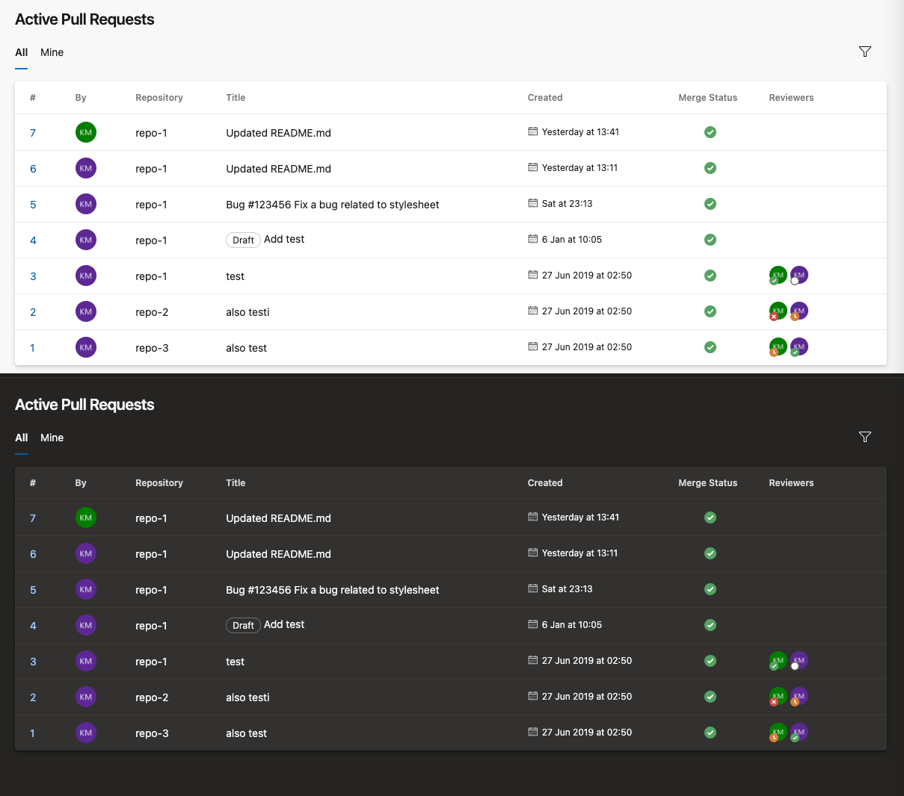

# Active Pull Requests
A VSTS extension for showing a list of all active pull requests for chosen projects with features such as sorting, filtering, and much more.

# Dependencies

* Node v16

# Install
    npm install
    npm start

# Building the sample project
    npm run build # or build:dev

This produces a .vsix file which can be uploaded to the [Visual Studio Marketplace](https://marketplace.visualstudio.com/azuredevops)

# Publishing
    npm run publish-extension-release # or publish-extension-dev

This automatically publishes to the [Visual Studio Marketplace](https://marketplace.visualstudio.com/azuredevops)

# Contributing

This project welcomes contributions and suggestions. Please see [CONTRIBUTING.md](CONTRIBUTING.md).

# Problems?

## Blank page in development

Visit https://0.0.0.0:3000 in your browser and bypass the certficate issue and then reload the extension page.
